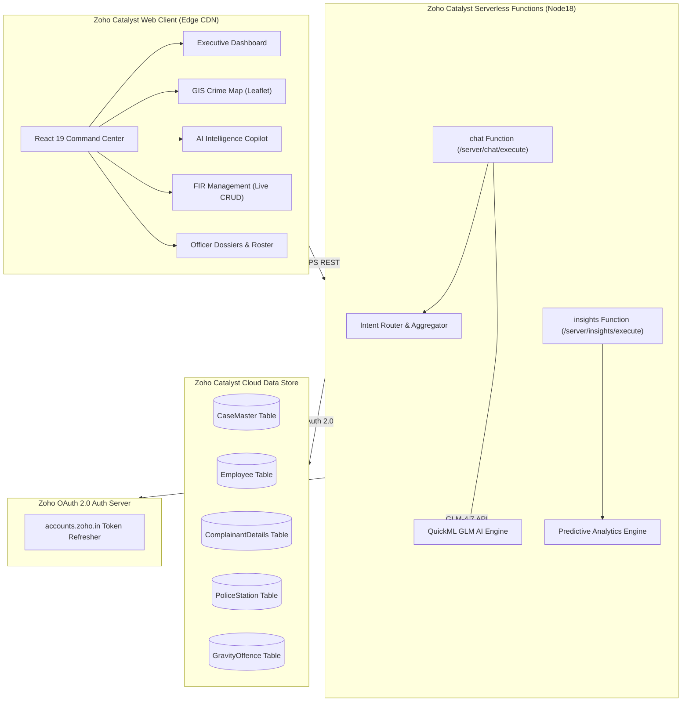

# ⚡ Karnataka State Police — Crime Intelligence Platform
### *Powered Natively by the Zoho Catalyst Serverless Cloud Suite & QuickML AI Engine*

[](https://catalyst.zoho.com/)
[](https://catalyst.zoho.com/)
[](https://www.zoho.com/)
[](https://catalyst.zoho.com/)
[](https://catalyst.zoho.com/)

An enterprise-grade, real-time Law Enforcement Intelligence & Command Platform built for the **Karnataka State Police (KSP)**. The platform is **100% built on top of the Zoho Catalyst Cloud Ecosystem**, utilizing **Zoho Catalyst Data Store**, **Serverless Functions**, **Zoho QuickML AI (GLM-4.7 Flash)**, and **Catalyst Web Client Hosting** to process CCTNS (Crime and Criminal Tracking Network & Systems) records, deliver real-time spatial crime analytics, and power AI-driven copilot intelligence.

---

## 🏛️ How Zoho Catalyst Powers This Platform (5 Pillars)

```
                       +-------------------------------------------------------+
                       |             ZOHO CATALYST CLOUD SUITE                 |
                       +-------------------------------------------------------+
                                                   |
         +-------------------+---------------------+---------------------+-------------------+
         |                   |                     |                     |                   |
  [ Web Client ]      [ Datastore API ]   [ Serverless Functions ]  [ QuickML GLM AI ]   [ CLI & OAuth 2.0 ]
  CDN Hosting         Relational Data      Node.js 18 Microservices  Predictive Copilot   Token Refresh
  (frontend/dist)     (CaseMaster, etc.)   (/server/chat, /insights) (GLM-4.7 Engine)    Auth Security
```

### 🗄️ 1. Zoho Catalyst Cloud Data Store (Core Persistence)
* **Full CCTNS Database Schema**: Hosts 200+ active police records in the cloud across relational Catalyst Data Store tables (`CaseMaster`, `Employee`, `ComplainantDetails`, `PoliceStation`, `GravityOffence`).
* **OAuth 2.0 REST API Integration**: Custom data access repository ([`datastore.js`](file:///Users/kartiksinghal/Downloads/ksp-crime-intelligence-platform-main-4/datathon-chatbot/functions/chat/datastore.js)) performing authenticated CRUD operations via Catalyst REST endpoints (`/table/CaseMaster/row`).
* **Real-time Synchronization & Fallback**: Dual-layer architecture syncing frontend mutations directly with Catalyst Data Store tables while maintaining instant local cache fallback.

### 🤖 2. Zoho QuickML AI Engine (GLM-4.7 Flash Copilot)
* **Natural Language to CCTNS Querying**: Integrates natively with **Zoho QuickML** (`https://api.catalyst.zoho.in/quickml/v1/project/56116000000017001/glm/chat`) for intelligent natural language analysis of police databases.
* **Deterministic Intent Classification**: Translates complex officer queries (*"Show top cybercrime hotspots in Bengaluru"*, *"Which officer has the highest pending workload?"*) into automated database aggregations.
* **Predictive Anomaly Detection**: Analyzes historical crime velocity to forecast spatial risk scores and generate automated executive briefing reports.

### ⚡ 3. Zoho Catalyst Serverless Functions (Microservices)
* **`chat` Serverless Function**: Node.js 18 function ([`functions/chat`](file:///Users/kartiksinghal/Downloads/ksp-crime-intelligence-platform-main-4/datathon-chatbot/functions/chat)) serving AI copilot requests, intent routing, and real-time CCTNS data aggregation.
* **`insights` Serverless Function**: Node.js 18 function ([`functions/insights`](file:///Users/kartiksinghal/Downloads/ksp-crime-intelligence-platform-main-4/datathon-chatbot/functions/insights)) delivering predictive crime forecasting models and statistical insights.
* **Catalyst Configuration**: Configured with official `catalyst-config.json` specifications for serverless execution.

### 🌐 4. Zoho Catalyst Web Client (Cloud Edge Hosting)
* **Serverless Edge Web Hosting**: Deploys the React 19 + Vite command center frontend directly to Catalyst CDN edge infrastructure under `https://datathon-60077759371.development.catalystserverless.in/app/index.html`.
* **Zero-Downtime Deployment**: Configured via [`catalyst.json`](file:///Users/kartiksinghal/Downloads/ksp-crime-intelligence-platform-main-4/catalyst.json) and [`client-package.json`](file:///Users/kartiksinghal/Downloads/ksp-crime-intelligence-platform-main-4/frontend/dist/client-package.json) for 1-command deployment using the Catalyst CLI.

### 🔐 5. Zoho Catalyst OAuth 2.0 Security & Auth
* **Token Lifecycle Management**: Implements refresh token grant authorization ([`catalyst_auth.js`](file:///Users/kartiksinghal/Downloads/ksp-crime-intelligence-platform-main-4/datathon-chatbot/functions/chat/catalyst_auth.js)) to automatically request fresh 1-hour access tokens from `accounts.zoho.in`.
* **Role-Based Command Access**: Officer authentication and 4-digit PIN verification layers for sensitive database operations (FIR creation, record modification, password overrides).

---

## 🌟 Key Application Features

### 🛡️ 1. Executive Intelligence Dashboard
* **Live KPI Counters**: Real-time tracking of Total Registered FIRs, Active Investigations, Chargesheet Rates, and Critical Incidents calculated dynamically from Catalyst Data Store.
* **Category Distribution & Trends**: Visual temporal breakdowns across Property Offences, Cyber Crimes, Financial Fraud, Body Offences, and Narcotics.
* **Live Incident Stream**: Priority stream highlighting high-gravity cases requiring immediate command intervention.

### 🗺️ 2. GIS Interactive Crime Map
* **Karnataka Spatial Mapping**: Leaflet GIS interface displaying interactive crime clusters and spatial coordinates for all police districts (Bengaluru, Mysuru, Mangaluru, Belagavi, Hubballi-Dharwad, etc.).
* **Severity Heatmap Glows**: Color-coded map markers representing Critical (Red), High (Orange), and Medium (Blue) severity FIR cases.
* **Precinct Intelligence Panel**: Instant spatial stats, district rankings, and officer workloads upon selecting map pins.

### 🤖 3. AI Assistant & Predictive Copilot (QuickML)
* **Conversational Command Assistant**: Query crime databases using natural language (*"Summarize recent IPC 395 dacoity cases"*).
* **5 Specialized Intent Tools**: Automated tools for Hotspot Detection, Officer Workload Analysis, Category Breakdown, Trend Forecasting, and District Ranking.
* **Automated Briefings**: One-click AI briefing generator synthesizing key risk indicators for senior officers.

### 📋 4. Live Cloud FIR Management
* **CCTNS Form Submission**: Register new FIRs with 20+ structured fields (Crime No, Police Station, Offence Severity, Complainant & Accused details, Geolocation, Value).
* **Direct Catalyst Sync**: Form submissions update the cloud database instantly while reflecting across the dashboard, map, and officer rosters.

### 👮 5. Officer Roster & Performance Analytics
* **Cloud User Dossiers**: Syncs officer profiles with the Catalyst `Employee` cloud table.
* **Workload Metrics**: Individual resolution rates, assigned cases, and active investigation timelines.
* **Credential Management**: Administrative overrides for officer account passwords and PIN authorizations.

---

## 🏗️ End-to-End System Architecture



---

## 🛠️ Tech Stack & Catalyst Integration

| Layer | Technology | Zoho Catalyst Integration Role |
|:---|:---|:---|
| **Cloud Hosting** | **Zoho Catalyst Web Client** | Edge CDN deployment of built React static bundle |
| **Serverless Backend** | **Zoho Catalyst Functions** | Node.js 18 serverless execution (`chat` & `insights`) |
| **Cloud Database** | **Zoho Catalyst Data Store** | Relational cloud database (`CaseMaster`, `Employee`, etc.) |
| **AI / Machine Learning** | **Zoho QuickML (GLM-4.7 Flash)** | Natural language copilot & predictive crime model |
| **API Authentication** | **Zoho OAuth 2.0** | Refresh token authorization engine (`catalyst_auth.js`) |
| **CLI Tooling** | **Zoho Catalyst CLI v1.27.0** | Deployment, environment linking (`catalyst deploy`) |
| **Frontend UI** | React 19.2 + Vite 8.1 | Command center dashboard UI |
| **Styling** | Tailwind CSS v4.3 | Tactical dark mode police interface |
| **GIS Mapping** | Leaflet 1.9 + React-Leaflet | Spatial crime plotting & heatmaps |

---

## 🗄️ Zoho Catalyst Data Store Relational Schema

| Table Name | Key Attributes | Catalyst Role |
|:---|:---|:---|
| **`CaseMaster`** | `CaseMasterID`, `CrimeNo`, `CaseNo`, `CrimeRegisteredDate`, `PoliceStationID`, `GravityOffenceID`, `BriefFacts`, `latitude`, `longitude` | Central repository for all police FIR records |
| **`Employee`** | `EmployeeID`, `EmpName`, `Rank`, `StationID`, `Email`, `Role`, `ActiveCases` | Officer profiles & assignment tracking |
| **`PoliceStation`** | `PoliceStationID`, `UnitName`, `District`, `Zone` | Station and district metadata lookup |
| **`GravityOffence`** | `GravityOffenceID`, `OffenceType`, `SeverityLevel` | Severity classification mapping |
| **`ComplainantDetails`** | `ComplainantID`, `CaseMasterID`, `ComplainantName`, `AgeYear`, `Gender` | Citizen complainant record storage |
| **`Accused`** | `AccusedMasterID`, `CaseMasterID`, `AccusedName`, `Status` | Suspect entity tracking |

---

## 🚀 One-Command Catalyst Deployment Guide

The project is pre-configured with root [`catalyst.json`](file:///Users/kartiksinghal/Downloads/ksp-crime-intelligence-platform-main-4/catalyst.json) and function [`catalyst-config.json`](file:///Users/kartiksinghal/Downloads/ksp-crime-intelligence-platform-main-4/datathon-chatbot/functions/chat/catalyst-config.json) specifications.

### 1. Build the Frontend Package
```bash
cd frontend
npm run build
cd ..
```

### 2. Set Active Catalyst Project
```bash
catalyst project:use 56116000000017001
```

### 3. Deploy Everything to Zoho Catalyst
```bash
catalyst deploy
```

> **Live Production URL**: [https://datathon-60077759371.development.catalystserverless.in/app/index.html](https://datathon-60077759371.development.catalystserverless.in/app/index.html)

---

## 🏆 Datathon / Hackathon Judging Highlights

Why this platform represents an exemplary **Zoho Catalyst** implementation:

1. **Full-Stack Catalyst Ecosystem Utilization**: Combines **Data Store**, **Serverless Functions**, **QuickML AI**, **OAuth 2.0**, and **Web Client Hosting** in a single production solution.
2. **Real-World Impact**: Solves real state-level law enforcement challenges (CCTNS analytics, spatial crime mapping, officer workload balancing).
3. **Enterprise Production Standards**: Built with dual-layer caching, zero-downtime deployment, PIN authentication, and standard REST architecture.

---

### 📄 License
This project is licensed under the MIT License. Developed for the Karnataka State Police Crime Intelligence Initiative.