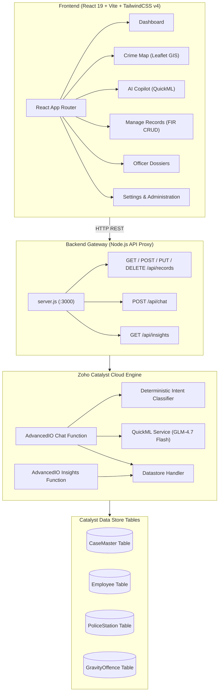

# 🚨 Karnataka State Police — Crime Intelligence Platform

[](https://react.dev/)
[](https://vitejs.dev/)
[](https://tailwindcss.com/)
[](https://catalyst.zoho.com/)
[](https://www.zoho.com/)
[](LICENSE)

An enterprise-grade, real-time Law Enforcement Intelligence & Analytics Command Center built for the **Karnataka State Police (KSP)**. Integrated with CCTNS (Crime and Criminal Tracking Network & Systems) data architecture, live **Zoho Catalyst Cloud Data Store**, and **Zoho QuickML AI** for spatial crime forecasting, automated intelligence briefs, and officer workload management.

---

## 🌟 Key Features

### 🛡️ 1. Executive Intelligence Dashboard
* **Real-time KPI Tracking**: Live metrics for Total FIRs Registered, Active Investigations, Chargesheet Rates, and Critical Cases.
* **Interactive Crime Trends**: Temporal crime pattern analysis (Monthly trends, Year-over-Year comparison).
* **Offence Distribution**: Visual analytics breakdown across Homicide, Robbery, Cybercrime, Narcotics, and Offense categories.
* **Live Incident Feed**: Priority feeds highlighting high-gravity cases requiring immediate command intervention.

### 🗺️ 2. GIS Interactive Crime Map
* **Spatial Mapping**: Leaflet-powered GIS mapping with custom map pins and severity glow rings.
* **District Cluster Heatmaps**: Real-time aggregation of crime density across Karnataka's police districts (Bengaluru, Mysuru, Hubballi-Dharwad, Mangaluru, etc.).
* **Intelligence Panel**: Instant spatial stats, district rankings, and precinct-level breakdowns upon clicking map nodes.

### 🤖 3. AI Assistant & Predictive Copilot
* **Natural Language Copilot**: Query CCTNS database in plain English ("Show cybercrime cases in Bengaluru", "Which officer has the highest pending workload?").
* **Spatio-Temporal Risk Forecasting**: AI-driven risk scoring model predicting high-risk zones and potential crime spikes.
* **Anomaly Alert System**: Automated alert triggers for sudden spikes in specific crime categories or geographical clusters.
* **Multi-Tool Backend**: 5 specialized intent tools (District Ranker, Officer Workload, Category Breakdown, Trend Analysis, Hotspot Detection).

### 📋 4. Live Cloud FIR Records Management
* **Direct Cloud Persistence**: Full CRUD (Create, Read, Update, Delete) operations interacting directly with the live Zoho Catalyst Cloud Data Store (`CaseMaster` table).
* **Comprehensive CCTNS Form**: Register new FIRs with 20+ structured fields (Crime No, Police Station ID, Offence Severity, Complainant & Accused details, Geolocation).
* **Relational Schema Normalization**: Automatic resolution of foreign keys into human-readable station names (`UnitName`) and severity classifications.

### 👮 5. Officer Roster & Performance Analytics
* **Cloud User Synchronization**: Dynamically synced user accounts driven by the Catalyst `Employee` cloud database table.
* **Performance Dossiers**: Individual officer workload metrics, case resolution rates, active assignments, and timeline trackers.
* **Officer Management Settings**: Administrative portal to create new officer profiles, assign ranks, and manage system access credentials.

### 📄 6. PDF Report Generation & Export
* **Custom Intelligence Briefs**: Generate printable executive briefs with custom temporal and district filters.
* **Official Format**: Built-in CSS print styling designed for official police department documentation.

### 🔐 7. Security & Role-Based Access Control
* **Dual Auth Modes**: Secure login interfaces for System Administrators and Station Officers.
* **Security PIN Authorization**: 4-digit PIN verification layer for sensitive database operations (modifying FIRs, deleting records, account updates).

---

## 🏗️ System Architecture



---

## 🛠️ Tech Stack

| Layer | Technology | Description |
|:---|:---|:---|
| **Frontend Framework** | React 19.2 | Core UI component engine |
| **Build Tool** | Vite 8.1 | High-performance dev server & bundler |
| **Styling** | Tailwind CSS v4.3 | Tactical command center dark theme |
| **Maps & GIS** | Leaflet 1.9 + React-Leaflet 5.0 | Interactive crime maps & spatial clustering |
| **Charts & Graphs** | Recharts 3.9 | Temporal trend lines & category bar charts |
| **Animations** | Framer Motion 12.4 | UI transitions & alert animations |
| **Backend Runtime** | Node.js (Native HTTP) | Lightweight REST gateway & proxy |
| **Cloud Infrastructure** | Zoho Catalyst SDK 3.4 | Serverless functions & Cloud Data Store |
| **AI / Machine Learning** | Zoho QuickML (GLM-4.7 Flash) | LLM inference & natural language analytics |
| **Database Schema** | CCTNS ER Architecture | Relational tables for cases, officers, and units |

---

## 🗄️ Database Schema (CCTNS Model)

The platform persistence is powered by **Zoho Catalyst Cloud Data Store** adhering to CCTNS relational standards:

| Table | Key Fields | Description |
|:---|:---|:---|
| **`CaseMaster`** | `CaseMasterID`, `CrimeNo`, `CaseNo`, `CrimeRegisteredDate`, `PoliceStationID`, `GravityOffenceID`, `BriefFacts`, `Latitude`, `Longitude` | Central repository for all FIR records |
| **`Employee`** | `EmployeeID`, `EmpName`, `Rank`, `StationID`, `Email`, `Role`, `ActiveCases` | Officer roster & user authentication profiles |
| **`PoliceStation`** | `PoliceStationID`, `UnitName`, `District`, `Zone` | Police station and unit metadata lookup |
| **`GravityOffence`** | `GravityOffenceID`, `OffenceType`, `SeverityLevel` | Crime classification & severity lookup |
| **`ComplainantDetails`** | `ComplainantID`, `CaseMasterID`, `ComplainantName`, `AgeYear`, `Gender` | FIR complainant details |
| **`Accused`** | `AccusedMasterID`, `CaseMasterID`, `AccusedName`, `Status` | Accused entity details |

---

## 🚀 Getting Started

### Prerequisites

Ensure you have the following installed locally:
* **Node.js** (v18.0.0 or higher)
* **npm** (v9.0.0 or higher)
* **Git**

### Installation

1. **Clone the Repository**:
   ```bash
   git clone https://github.com/m-agrawal09/ksp-crime-intelligence-platform.git
   cd ksp-crime-intelligence-platform
   ```

2. **Install Root & Frontend Dependencies**:
   ```bash
   # Install root dependencies
   npm install

   # Install frontend dependencies
   cd frontend
   npm install
   cd ..
   ```

---

## 🏃 Running the Application

You can run both the **Backend API Server** and **Frontend Web Application** concurrently:

### 1. Start Backend Server
In the root directory:
```bash
node server.js
```
*Backend API Server will start on `http://localhost:3000`*

### 2. Start Frontend Dev Server
In a new terminal window:
```bash
cd frontend
npm run dev
```
*Frontend Web Application will start on `http://localhost:5173`*

---

## 🔐 Credentials for Testing

Use the following credentials to explore the platform features:

| Role | Username | Password | Security PIN | Access Level |
|:---|:---|:---|:---|:---|
| **System Administrator** | `admin` | `admin` | `1122` | Full Access (All Districts, User Mgmt, Database Edits) |
| **Station Officer** | `kartik` | `officer123` | `1122` | Station-Level Dossier, Case Updates |
| **Police Officer** | `medhavi` | `officer123` | `1122` | Station-Level Dossier |

---

## 📡 API Endpoints Summary

| Method | Endpoint | Description |
|:---|:---|:---|
| `GET` | `/api/records` | Fetch all FIR records from Zoho Catalyst Data Store |
| `POST` | `/api/records` | Create a new FIR record in `CaseMaster` table |
| `PUT` | `/api/records/:id` | Update existing FIR record |
| `DELETE` | `/api/records/:id` | Delete FIR record from database |
| `POST` | `/api/chat` | Send natural language prompt to AI Copilot & QuickML |
| `GET` | `/api/insights` | Retrieve automated spatio-temporal risk insights |

---

## 📜 License

Distributed under the MIT License. See `LICENSE` for more details.

---

<p align="center">
  Developed for the <b>Zoho Catalyst Datathon</b> • Empowering Law Enforcement with Intelligent Data Solutions
</p>